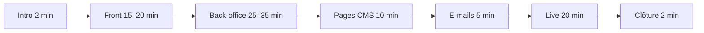
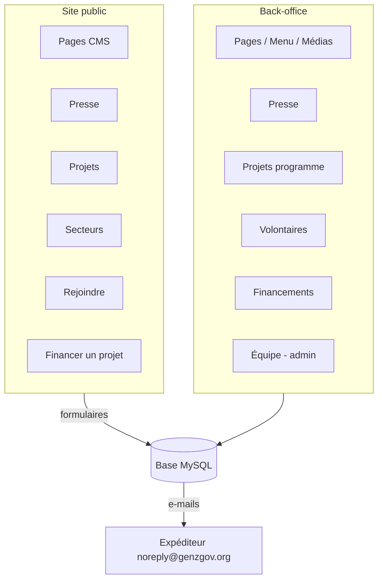
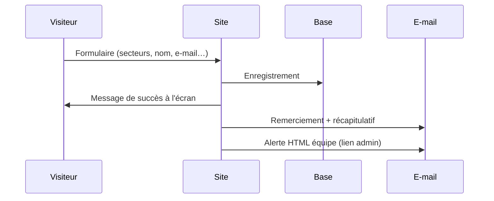
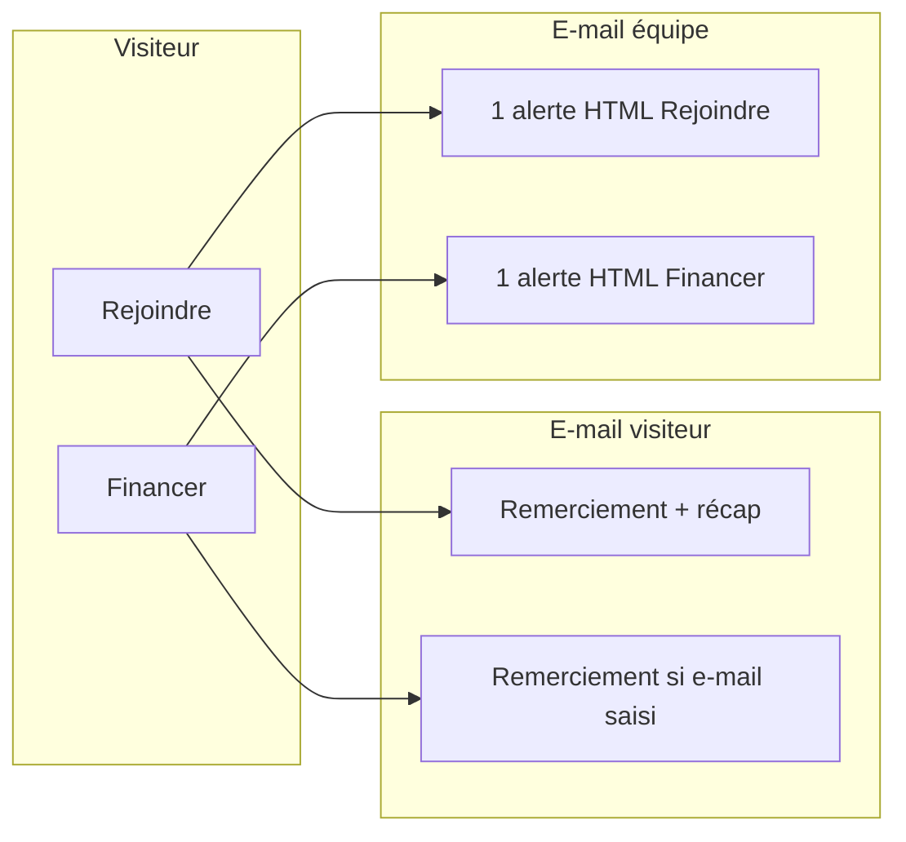
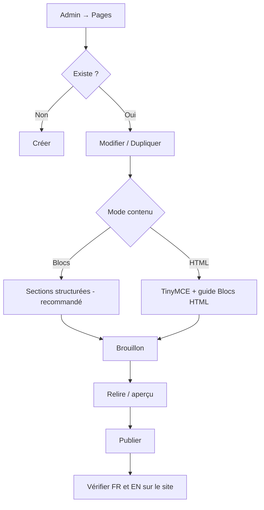

# Guide de présentation — Gov Gen Z

**Application web** · Site public + back-office  
**Audience** : modérateurs, éditeurs, administrateurs  
**Durée indicative** : 50–70 minutes (dont démo live ~20 min)

---

## Sommaire

1. [Message d’ouverture](#message-douverture)
2. [Avant la démo](#avant-la-démo)
3. [Architecture en un coup d’œil](#architecture-en-un-coup-dœil)
4. [Partie 1 — Site public (front)](#partie-1--site-public-front)
5. [Partie 2 — Back-office](#partie-2--back-office)
6. [Rôles : éditeur vs administrateur](#rôles-éditeur-vs-administrateur)
7. [E-mails et notifications](#e-mails-et-notifications)
8. [Gestion des pages CMS](#gestion-des-pages-cms)
9. [Pages test vs production](#pages-test-vs-production)
10. [Scénario live recommandé](#scénario-live-recommandé)
11. [Ce qu’il faut marteler](#ce-quil-faut-marteler)
12. [Limites et évolutions](#limites-et-évolutions)
13. [Checklist jour J](#checklist-jour-j)
14. [Clôture](#clôture)

---

## Message d’ouverture

> **Gov Gen Z** dispose d’un **site public** pour informer et recueillir l’engagement, et d’un **back-office** pour traiter les demandes et publier le contenu.
>
> Vous n’avez pas besoin de toucher au code : menu, pages, presse, projets, candidatures et financements sont gérés depuis l’administration.

**Objectifs de la session**

| Objectif | Résultat attendu |
|----------|------------------|
| Comprendre le parcours visiteur | Savoir d’où viennent les demandes |
| Savoir traiter au quotidien | Volontaires + financements projets |
| Distinguer les zones admin | Contenu vs données vs technique |
| Poser le cadre « évolutif » | Tests aujourd’hui, contenus stabilisés demain |

---

## Avant la démo

### Environnement

| Élément | URL / accès |
|---------|-------------|
| Site public | `https://genzgov.org/` |
| Back-office | `https://genzgov.org/admin/login` |
| Compte **admin** | À préparer (mot de passe connu) |
| Compte **éditeur** | À préparer (mot de passe connu) |

### Données de démo

- [ ] Au moins **1 projet publié** avec financement et/ou matériel activé
- [ ] **1–2 candidatures** Rejoindre en statut **Nouvelle**
- [ ] **1 proposition** de financement en statut **Nouvelle**
- [ ] Menu du site à jour
- [ ] Migrations SQL appliquées en prod (`donor_email`, `notify_form_submissions`) si financements / notifications équipe

### Ordre de présentation conseillé



---

## Architecture en un coup d’œil



### Types de contenu — ne pas tout confondre

| Type | Exemple URL | Où l’éditer | Modérateur au quotidien |
|------|-------------|-------------|-------------------------|
| **Pages CMS** | `/contact`, `/qui-sommes-nous` | Admin → **Pages** | Rédaction |
| **Presse** | `/press/…` | Admin → **Presse** | Rédaction |
| **Projets** | `/projects/…` | Admin → **Projets programme** | Rédaction + validation financements |
| **Secteurs** | `/secteurs` | Admin → **Secteurs** | Paramétrage |
| **Rejoindre** | `/join` | Admin → **Volontaires** | **Traitement** |
| **Financer** | fiche projet | Admin → **Financements projets** | **Traitement** |

---

## Partie 1 — Site public (front)

### Navigation et socle

- **Menu** → éditable dans **Admin → Menu du site** (liens + surlignage de la page active)
- **FR / EN** → bascule en haut de page
- **Bandeau cookies** + analytics (si activé en production)
- **Pied de page** → en partie alimenté par la page CMS `site-footer` (voir [Gestion des pages](#gestion-des-pages-cms))

---

### Pages institutionnelles (CMS)

Contenu riche en base — **pas** des fichiers HTML figés sur le serveur.

Exemples typiques :

- Accueil  
- À propos / Qui sommes-nous  
- Contact  
- Mentions légales  

> Le **hero** (titre, chapô, image) et le **corps** sont éditables séparément du menu.

---

### Secteurs — `/secteurs`

- Présentation des **14 équipes sectorielles**
- Lien possible vers **Rejoindre** avec secteur(s) pré-sélectionné(s)

---

### Rejoindre — `/join` ⭐ workflow clé



| Étape visiteur | Détail |
|----------------|--------|
| 1 | Un ou plusieurs **secteurs** |
| 2 | **Nom**, **e-mail** (obligatoire), téléphone (optionnel), message |
| 3 | Envoi → confirmation à l’écran |
| 4 | **E-mail automatique** : remerciement + récapitulatif |
| 5 | **Équipe notifiée** : alerte avec bouton *Traiter dans le back-office* |

> **Phrase à retenir** : *Le visiteur est rassuré ; l’équipe est notifiée pour traiter.*

---

### Presse — `/press`

- Liste des **communiqués**
- Fiche article détaillée

---

### Projets — `/projects`

| Fonctionnalité | Description |
|----------------|-------------|
| **Liste** | Filtres (secteur, statut, etc.) |
| **Fiche projet** | Héros, avancement, contenu, barre latérale |
| **Financer ce projet** | Modal budget ou matériel |
| **Partage** | QR code, Facebook, LinkedIn, TikTok, e-mail… |

**Formulaire Financer**

- Nom, **téléphone** (obligatoire)
- **E-mail** (facultatif → remerciement si renseigné)
- Notification **équipe** à chaque envoi (alerte HTML)

---

## Partie 2 — Back-office

**URL** : `/admin` → connexion par **e-mail** + **mot de passe**.

### Menu latéral — carte mentale

```
Tableau de bord
│
├── CONTENU
│   ├── Menu du site
│   ├── Pages
│   ├── Blocs HTML (aide)
│   ├── Presse
│   └── Médias
│
├── DONNÉES  ← cœur modération
│   ├── Volontaires      (Rejoindre)
│   └── Secteurs
│
├── PROJETS
│   ├── Financements projets
│   ├── Projets programme
│   └── Taux de change
│
└── ADMINISTRATION  (admin uniquement)
    ├── Journal connexion
    └── Équipe
```

---

### Volontaires — `/admin/volunteers`

| Filtre | Usage |
|--------|--------|
| **Nouvelles** | À traiter en priorité |
| **Traitées** | Suivi interne |
| **Toutes** | Historique |

**Actions**

- Lire le détail (message, secteurs)
- **Marquer comme traitée** après contact
- Répondre via le lien `mailto:` dans la liste

Les e-mails d’alerte pointent vers `#vol-row-XXX` dans cette liste.

---

### Financements projets — `/admin/project-contributions`

| Statut | Signification |
|--------|----------------|
| **Nouvelle** | À examiner |
| **Validée (publiée)** | Visible sur la fiche projet **FR et EN** (nom + type, **sans** coordonnées) |
| **Refusée** | Non affichée publiquement |

**Actions**

| Bouton | Effet |
|--------|--------|
| **Détail** | Voir toute la proposition |
| **Valider et publier** | Affichage public du soutien (sans téléphone / e-mail) |
| **Refuser** | Hors scope ou doublon |

> ⚠️ **Important** : valider = publication sur le site. Ne pas publier de coordonnées personnelles via ce mécanisme.

---

### Secteurs — `/admin/sectors`

- Libellés **FR / EN**
- E-mail de contact affiché sur le site
- Ordre d’affichage, actif / inactif

---

### Projets programme — `/admin/project-projects`

- Création, édition, **duplication**
- Publication, slug, secteurs, budget affiché
- Corps : **HTML** ou **blocs structurés**
- Lien vers la fiche publique depuis l’admin

*Évolution prévue* : interface plus « carte / détail » alignée sur le site (aujourd’hui : formulaire complet — MVP).

---

### Contenu éditorial

| Écran | Rôle |
|-------|------|
| **Menu du site** | Liens navigation + page active surlignée |
| **Pages** | Pages institutionnelles CMS |
| **Blocs HTML (aide)** | Exemples HTML conformes à la charte |
| **Presse** | Communiqués |
| **Médias** | Bibliothèque images / fichiers |

---

### Équipe — `/admin/staff-users` *(admin seulement)*

| Action | Description |
|--------|-------------|
| **Inviter** | E-mail d’activation (lien 24 h par défaut) |
| **Rôle** | Administrateur ou Éditeur |
| **Actif / Désactivé** | Couper l’accès |
| **Notifications** | Activer / **Désactiver les notifications** (alertes Rejoindre + Financer) |

**Journal connexion** : audit des tentatives de connexion (admin).

---

## Rôles : éditeur vs administrateur

| Capacité | Éditeur | Administrateur |
|----------|:-------:|:--------------:|
| Pages, menu, presse, médias | ✅ | ✅ |
| Volontaires, financements, secteurs, projets | ✅ | ✅ |
| Inviter / gérer l’équipe | ❌ | ✅ |
| Journal connexion | ❌ | ✅ |
| Vider certaines tables (tests) | ❌ | ✅ |

> Les **éditeurs** = modérateurs / rédacteurs au quotidien.  
> Les **administrateurs** = comptes + sécurité + technique légère.

---

## E-mails et notifications

### Schéma global



### Qui reçoit les alertes équipe ?

1. Comptes **staff** dans **Équipe** : actifs, invitation **activée**, **notifications activées**
2. **Secours** : variable `.env` `join.notification.to` si aucun compte éligible en base

### Ce que l’équipe ne reçoit pas

| E-mail | Destinataire |
|--------|----------------|
| Remerciement visiteur | **Visiteur uniquement** |
| Copie du remerciement | ❌ **Pas** envoyée aux modérateurs |
| Invitation back-office | **Personne invitée** uniquement |

### Templates

| Type | Format | Objet typique |
|------|--------|----------------|
| Alerte modération | HTML (bandeau Modération + CTA back-office) | `[Gov Gen Z — Site] Nouvelle candidature…` |
| Remerciement visiteur | HTML (charte Gov Gen Z) | `Merci pour votre candidature…` |

---

## Gestion des pages CMS

### Idée centrale

> Les **pages fixes** vivent en **base**, éditées dans **Admin → Pages**.  
> Le contenu actuel est une **première version** (tests) : la **structure CMS** est en place ; les **textes** mûrissent avec vous.

### Anatomie d’une page

| Champ | Rôle |
|-------|------|
| **Slug** | URL : `/contact`, `/mentions-legales`… |
| **Langue** | Ligne **FR** + ligne **EN** (groupe de traduction) |
| **Statut** | `Brouillon` (invisible) · `Publié` (visible) |
| **Hero** | Sur-titre, titre, chapô, image |
| **Corps** | Mode **HTML** (TinyMCE) ou **blocs** (sections structurées) |
| **SEO** | Meta titre, meta description |
| **Menu** | Entrée dans **Menu du site** + page **publiée** |

### Cas particuliers

| Slug | Comportement |
|------|----------------|
| `site-footer` | Alimente le **pied de page** — pas une page publique classique |
| `mentions-legales` | Légal + cookies ; hero séparé du corps |
| `join`, `press`, `projects`… | **Routes réservées** — ne pas créer de page CMS au même slug |

### Parcours édition (modérateur / rédacteur)



### Bonnes pratiques

| ✅ À faire | ❌ À éviter |
|-----------|------------|
| Travailler en **brouillon** d’abord | Publier sans relecture |
| Utiliser **Blocs HTML (aide)** | HTML libre qui casse la charte |
| Dupliquer pour tester | Supprimer `site-footer` ou `mentions-legales` |
| Publier FR **et** EN si le site est bilingue | Modifier uniquement le menu sans page publiée |

### Cache

Après une grosse modification, si le site ne bouge pas :

- Ré-enregistrer la page
- Navigation privée pour tester
- Côté technique : cache `writable/cache/` ou `app.assetVersion` dans `.env`

---

## Pages test vs production

| Aujourd’hui (tests) | Demain (évolution) |
|---------------------|-------------------|
| Textes provisoires | Validation com / juridique |
| Mélange HTML + blocs | Modèles par type de page |
| Traductions EN incomplètes | Paires FR/EN systématiques |
| Gabarits génériques | Accueil, institutionnel, légal dédiés |

### Ce qui évoluera sans tout refaire

- Nouveaux **blocs** CMS (comme sur les fiches projets)
- **Prévisualisation** brouillon renforcée
- **Workflow** brouillon → relecture → publication
- **Historique** des versions (pas encore disponible)
- Footer / header davantage pilotés par le CMS

### Ce qui reste technique

- Nouvelle URL en conflit avec une route existante
- Refonte graphique globale (CSS, gabarits)
- Nouveaux formulaires ou rubriques métier

> **Message rassurant** : mettre à jour l’accueil ou les mentions légales ne demande pas un développeur à chaque fois — sauf pour une **nouvelle fonctionnalité**.

---

## Scénario live recommandé

**Durée** : ~20 minutes

| # | Action | Où | Point à montrer |
|---|--------|-----|-----------------|
| 1 | Envoyer candidature test | `/join` | Parcours visiteur |
| 2 | Montrer les e-mails | Boîte mail | Visiteur + alerte équipe |
| 3 | Traiter la candidature | Admin → Volontaires | Filtre Nouvelles → **Traitée** |
| 4 | Proposition financement | Fiche projet → Financer | Modal + envoi |
| 5 | Valider la proposition | Admin → Financements | **Valider et publier** |
| 6 | Vérifier le site | Fiche projet publique | Nom visible, pas de coordonnées |

**Plan B** : si l’e-mail live échoue, montrer directement les lignes déjà en base dans l’admin.

---

## Ce qu’il faut marteler

1. **Quotidien modérateur** = **Volontaires** + **Financements projets** (+ réponses e-mail).
2. **Publier un soutien** = bouton *Valider et publier* — pas de copier-coller de coordonnées sur le site.
3. **Rejoindre** = traitement interne ; statut *Traitée* = suivi d’équipe.
4. **Notifications** : désactivables par personne dans **Équipe**.
5. **Pages** = contenu évolutif ; structure CMS déjà là — textes à stabiliser ensemble.
6. **Contenu long** (pages, projets) = profil rédacteur ; ne pas tout modifier en live sans brouillon.

---

## Limites et évolutions

| Sujet | État actuel |
|-------|-------------|
| Application mobile dédiée | Non — site responsive + admin navigateur |
| Éditeur projets | Formulaire dense (MVP) |
| Cache front | Possible délai après publication |
| Copies e-mail modérateurs | Uniquement **alertes**, pas copie remerciement visiteur |
| Révisions de pages | Non — contenu = version en base |

---

## Checklist jour J

### Technique

- [ ] Laptop chargé, connexion stable
- [ ] URLs prod / préprod testées
- [ ] Comptes admin + éditeur prêts
- [ ] Données de démo en base (volontaire + financement « Nouvelle »)

### Onglets navigateur

- [ ] Accueil site  
- [ ] `/join`  
- [ ] 1 fiche projet  
- [ ] `/admin/volunteers`  
- [ ] `/admin/project-contributions`  
- [ ] `/admin/pages` (optionnel)  
- [ ] `/admin/staff-users` (si admin présente)

### Répartition des rôles

- [ ] Qui crée les comptes (**admin**)
- [ ] Qui modère les demandes (**éditeur**)
- [ ] Contact support technique identifié

---

## Clôture

> **Demain**, vous commencez par **Volontaires** et **Financements**.  
> Pour les **pages** et les **projets**, on avance par binômes rédaction / technique.  
> Les contenus visibles aujourd’hui sont des **tests** : la plateforme est prête à accueillir les textes définitifs au fil de vos retours.

**Questions** : noter les demandes (nouveau bloc, nouvelle page, workflow) pour priorisation après la présentation.

---

## Annexe — URLs admin rapides

| Écran | Chemin |
|-------|--------|
| Connexion | `/admin/login` |
| Tableau de bord | `/admin` |
| Pages | `/admin/pages` |
| Guide blocs HTML | `/admin/cms-guide` |
| Menu | `/admin/site-menu` |
| Presse | `/admin/posts` |
| Médias | `/admin/media` |
| Volontaires | `/admin/volunteers` |
| Secteurs | `/admin/sectors` |
| Financements | `/admin/project-contributions` |
| Projets | `/admin/project-projects` |
| Taux de change | `/admin/project-exchange-rates` |
| Équipe | `/admin/staff-users` |
| Journal connexion | `/admin/login-events` |

---

*Document généré pour la présentation modérateurs — Gov Gen Z · CodeIgniter 4 · `govgenz-ci`*
